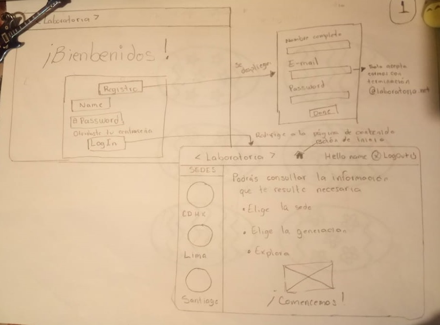
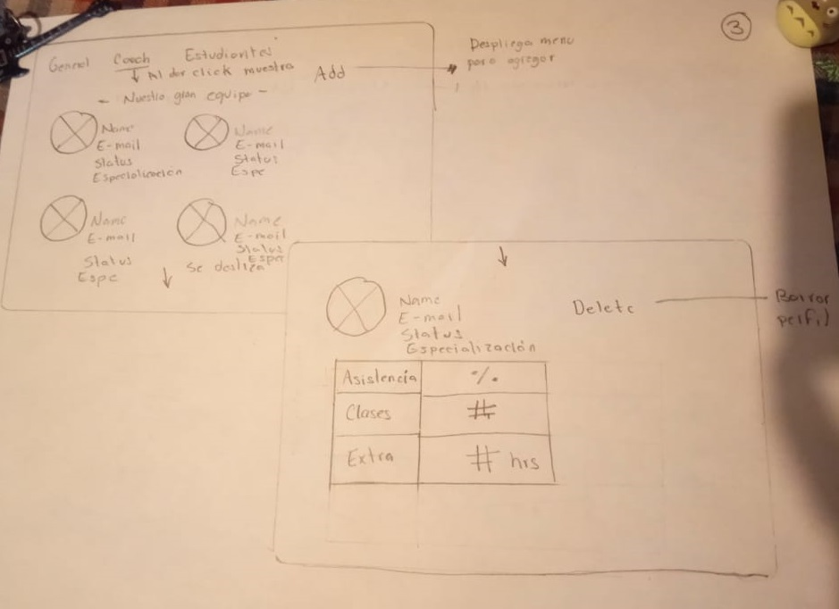
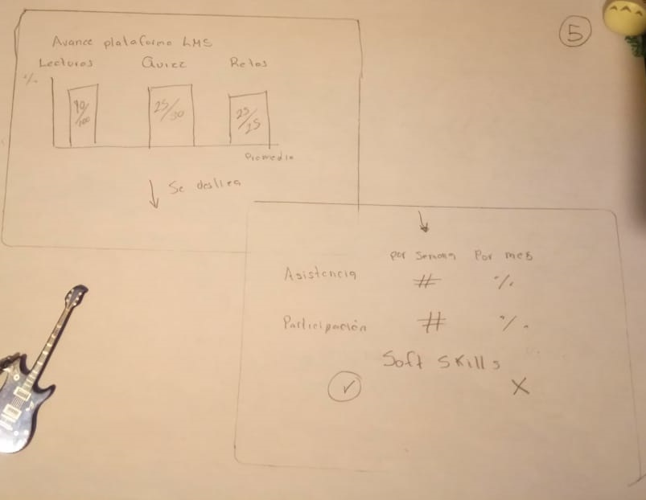

# **Data Dashboard**

## **Proceso de UX**

Nuestro primer acercamiento lo haremos a través del proceso de diseño, donde
pasamos por diferentes etapas como:

### **1. Descubrimiento e investigación**

En Laboratoria, las Training Managers (TMs) realizan una gran labor al analizar y procesar una cantidad considerable de datos al día, de acuerdo al progreso de las estudiantes y todo ello con el propósito de apoyarlas en su aprendizaje durante el bootcamp y después del mismo.

Para apoyar a este gran equipo que se esfuerza día con día en mejorar la experiencia de las estudiantes, así es como se plantea el elaborar una interfaz donde las TMs puedan visualizar y hacer uso de la data que pueda ser de mayor utilidad o más relevante para ellas por medio de un tablero de visualización de datos.

Al entrevistar a dos de las Training Managers (Lucile TM de Ciudad de México y a Carla TM de Guadalajara) se obtiene la importancia para ellas de contar con un Data Dashboard con datos ya procesados con información relevante para ellas, debido a que las herramientas con las que cuentan para manipular esa data no es muy práctica para consultar y utilizar, algunas de esas herramientas son muy básicas como google drive y excel, mismas que consultan a diario y puede resultar agotador estar con muchas pestañas abiertas e incluso se presta a tener una pérdida de tiempo al buscar datos que en una plataforma podrías optimizar esa misma labor al procesar la información ya filtrada.

Las TMs tienen el objetivo de comunicar al staff de Laboratoria para generar una comunicación funcional al poder visualizar en números o porcentajes el desempeño de cada una de las estudiantes y con ello tomar decisiones de que estrategias podrían ser funcionales para aplicar durante clases.

__Usuarixs:__ Las Training Managers del equipo de Laboratoria son nuestro usuario objetivo, se tuvo el acercamiento con Lucile TM de Ciudad de México por medio de entrevista y al observar tan ardua labor que realiza, aunque una aplicación funcional como podría llegar a ser el Data Dashboard podría ser de utilidad para el área de Job Placement Manager y Alumni Network Manager.  

__Necesidades de las usuarias:__ Le interesa acceder a las sedes para poder comparar la información con las otras sedes, requiere la data de las generaciones para hacer otra comparación de los niveles de completitud en cada generación y conocer el dato de cuantas estudiantes siguen activas eso en comparación con cuantas entraron para analizar los resultados de posibles razones de fallo o de complicaciones que hizo que ya no terminaran el bootcamp, a nivel de las estudiantes le interesa conocer el nivel de completitud del LMS.

__Objetivos de las usuarias:__ Espera que la aplicación sea intuitiva y que el acceso sea rápido, pero que tenga filtros de seguridad debido a que esa información es delicada y las estudiantes o ajenos a Laboratoria puedan hacer un mal uso de la información.

__Pain points:__ Las herramientas que utiliza diariamente son muy básicas como excel y sí requiere data de otra sede debe recurrir a Google Drive navegar en las distintas secciones de la app, encontrar lo que requiere filtrando de manera manual, se le dificulta visualizar tantos documentos y con la complicación de cada sistema de control de las otras sedes no es un sistema unificado.

Se realizaron audios de las entrevistas a los usuarios y se ocupo material compartido con compañeras de otros squads.

#### Entrevistados (Información obtenida con apoyo del grupo) 

Karla Rejas Training Manager Sede Guadalajara:Liderea el equipo de formación, utiliza data para ver el desempeño de las estudiantes, visualizan la data por medio de spreadsheets. Excel le parece mucha pérdida de tiempo no tiene información actualizada, le gustaría ver porcentajes de las estudiantes para su desempeño.

Alejandra Ramirez Training Manager Sede Lima: Mantiene un seguimiento del progreso de las estudiantes y según ello tomar las decisiones necesarias para ofrecerles la mejor experiencia de aprendizaje, usa base de datos  para conocer cómo están avanzando las estudiantes, visualiza por
medio de spreadsheet lleno de data en tablas.

Jonathan Parra Coach Staff Ciudad de México: Es parte del equipo de formación que se encarga de que las estudiantes tengan apoyo durante el bootcamp, maneja bases de datos para saber como va el desempeño de las estudiantes actualmente usa Excel, comparten información por Google drive.

Mike Nieva Coach Staff Ciudad de México: Imparte clases y asesorías personalizadas usa base de datos para capturar progresos, observaciones, asistencia, calificaciones y revisar la actuzalición de esa data, usa mayormente data de calificaciones de los sprints, y avances en el LMS, comparte información por Excel.

### **2. Síntesis y definición**

Ahora que se conoce la información relevante sobre la utilidad de la aplicación a nivel usuario nos interesa satisfacer o dar solución a las necesidades de Laboratoria nuestro cliente, transformando esas necesidades en algo satisfactorio al optimizar esfuerzos de sus usuarios ofreciendo herramientas que enriquecen esa labor armoniosa entre la Start Up Laboratoria para con sus colaboradores y visualizar un punto de partida que unifique esfuerzos.

__1. Cuáles crees que son los datos más importantes a tener en cuenta para el Data Dashboard:__

   - Sobre las estudiantes:
   Tener fácil acceso a la información de contacto de las estudiantes que obtuvieron su R/E y lograr el objetivo de colocarlas en el área laboral, además de conocer los niveles de completitud de cada una, ofrece esa visibilidad de reconocer esfuerzos. 
 

__2. Lo que los usuarios esperan obtener:__

   Las Training Managers esperan poder optimizar sus esfuerzos unificando el sistema con estrategias en conjunto para una mayor comunicación ya no a nivel una sola sede sino a nivel Laboratoria completa con todas sus sedes con el staff en constante actualización, con esa armonía de tener datos que se actualizan y no datos que deban refrescar de manera poco convencional.

__3. Insights:__
   La visión de nuestras usuarias es la de mejorar sus esfuerzos para ofrecer un ambiente lleno de armonía entre el staff de cada sede y las estudiantes de cada generación, mejorando a través de la prueba y error, analizar información de forma objetiva.

__4. Data proporcionada:__ 

     -_Data relacionada a los cursos:_
      * Nos proporcionan la duración del programa
      * Porcentaje de completado
      * Temas
      * Subtemas  

__5. Insights del negocio:__
   La visión de nuestro cliente es la de optimizar los esfuerzos de sus colaboradores ofreciendoles mejores herramientas para el desempeño de sus actividades y para armonizar los sistemas de control y mantener una actualización más eficiente. 

### **3. Ideación**

En dupla comenzamos a maquetar en nuestras mentes una manera de obtener un producto sencillo a la vista, de fácil utilización y manipulación, pero con la potencia o posibilidad de dar solución a una necesidad bastante clara, teniendo el acercamiento de nuestra Training Manager de Ciudad de México, y de tener la delicadeza de comprender y aterrizar esa solución a algo funcional.

### **4. Prototipado** 

A continuación se muestra en imágenes el proceso en papel de nuestro sketch de baja fidelidad y con el feedback que se obtenga proceder a uno de mediana fidelidad de igual forma se procede con un prototipo elaborado en Marvel app de baja fidelidad.

Sketch: 

Prototipo en Marvel: :floppy_disk: :computer: :space_invader: (https://marvelapp.com/project/3150233/) 

### **5. User testing**
(Si deseas validar tu propuesta, acércate a tu usuario y que te de feedback con el fin de mejorar tu producto en beneficio del negocio y de tu usuarix).
****

